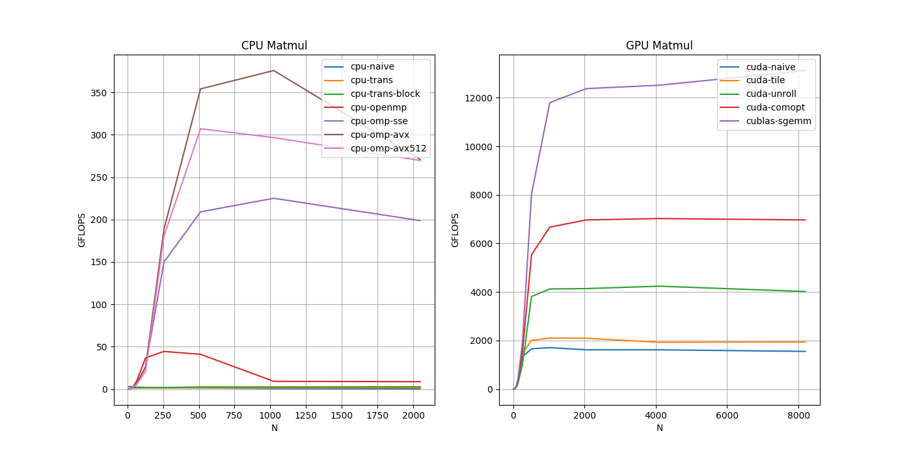

# Matrix Multiplication Optimization Methods
This is a toy benchmark experiment of several matrix multiplication algorithms. 

## Requirements
- googletest
- google/benchmark
- openmp
- CUDA

## Algorithms
- Naive
- Using OpenMP
- Using SIMD (CUDA)
- Strassen 


## Benchmark
run the benchmark via the executable `bench`, an example log : 
```
Running ./bench
Run on (48 X 3500 MHz CPU s)
CPU Caches:
  L1 Data 32 KiB (x24)
  L1 Instruction 32 KiB (x24)
  L2 Unified 1024 KiB (x24)
  L3 Unified 16896 KiB (x2)
Load Average: 2.25, 1.06, 0.95
***WARNING*** CPU scaling is enabled, the benchmark real time measurements may be noisy and will incur extra overhead.
----------------------------------------------------------------------
Benchmark                            Time             CPU   Iterations
----------------------------------------------------------------------
CPU-Naive/8/manual_time          0.372 us        0.398 us      1873137
CPU-Naive/16/manual_time          2.79 us         2.82 us       245379
CPU-Naive/32/manual_time          24.4 us         24.4 us        28740
CPU-Naive/64/manual_time           230 us          230 us         3051
CPU-Naive/128/manual_time         2121 us         2121 us          330
CPU-Naive/256/manual_time        18533 us        18532 us           38
CPU-Naive/512/manual_time       170520 us       170511 us            4
CPU-Naive/1024/manual_time     3152262 us      3152122 us            1
CPU-Naive/2048/manual_time    41267121 us     41264725 us            1
CPU-Naive/4096/manual_time   620636631 us    620598655 us            1
CPU-Naive/manual_time_BigO  117568617.95 N    117561438.47 N    
CPU-Naive/manual_time_RMS          133 %           133 %    
CPU-OpenMP/8/manual_time          10.7 us         11.0 us        65095
CPU-OpenMP/16/manual_time         11.9 us         12.1 us        61912
CPU-OpenMP/32/manual_time         13.0 us         13.2 us        54654
CPU-OpenMP/64/manual_time         21.6 us         21.7 us        32434
CPU-OpenMP/128/manual_time        83.4 us         83.5 us         8481
CPU-OpenMP/256/manual_time         657 us          657 us         1061
CPU-OpenMP/512/manual_time        7068 us         7024 us           87
CPU-OpenMP/1024/manual_time     218275 us       215265 us            3
CPU-OpenMP/2048/manual_time    2065809 us      1975598 us            1
CPU-OpenMP/4096/manual_time   34425140 us     30749125 us            1
CPU-OpenMP/8192/manual_time  420507095 us    404804633 us            1
CPU-OpenMP/manual_time_BigO 40124264.83 N    38516287.06 N    
CPU-OpenMP/manual_time_RMS         134 %           136 %    
GPU-Naive/8/manual_time           6.49 us         6.52 us       107719
GPU-Naive/16/manual_time          6.77 us         6.79 us       103171
GPU-Naive/32/manual_time          7.21 us         7.24 us        93359
GPU-Naive/64/manual_time          7.43 us         7.46 us        86643
GPU-Naive/128/manual_time         9.66 us         9.69 us        72564
GPU-Naive/256/manual_time         33.4 us         33.5 us        20922
GPU-Naive/512/manual_time          219 us          219 us         3196
GPU-Naive/1024/manual_time        1657 us         1657 us          422
GPU-Naive/2048/manual_time       14244 us        14243 us           49
GPU-Naive/4096/manual_time      114165 us       114158 us            6
GPU-Naive/8192/manual_time      963094 us       963074 us            1
GPU-Naive/manual_time_BigO    93746.27 N      93744.12 N    
GPU-Naive/manual_time_RMS          119 %           119 %    
GPU-Shared/8/manual_time          5.85 us         5.87 us       119866
GPU-Shared/16/manual_time         6.23 us         6.26 us       112234
GPU-Shared/32/manual_time         7.27 us         7.30 us        96541
GPU-Shared/64/manual_time         9.03 us         9.05 us        77446
GPU-Shared/128/manual_time        12.4 us         12.4 us        56412
GPU-Shared/256/manual_time        22.1 us         22.1 us        31651
GPU-Shared/512/manual_time         131 us          131 us         5359
GPU-Shared/1024/manual_time        990 us          990 us          707
GPU-Shared/2048/manual_time       7927 us         7927 us           88
GPU-Shared/4096/manual_time      66945 us        66941 us           11
GPU-Shared/8192/manual_time     542039 us       542013 us            1
GPU-Shared/manual_time_BigO   52883.29 N      52880.67 N    
GPU-Shared/manual_time_RMS         118 %           118 %   
```



