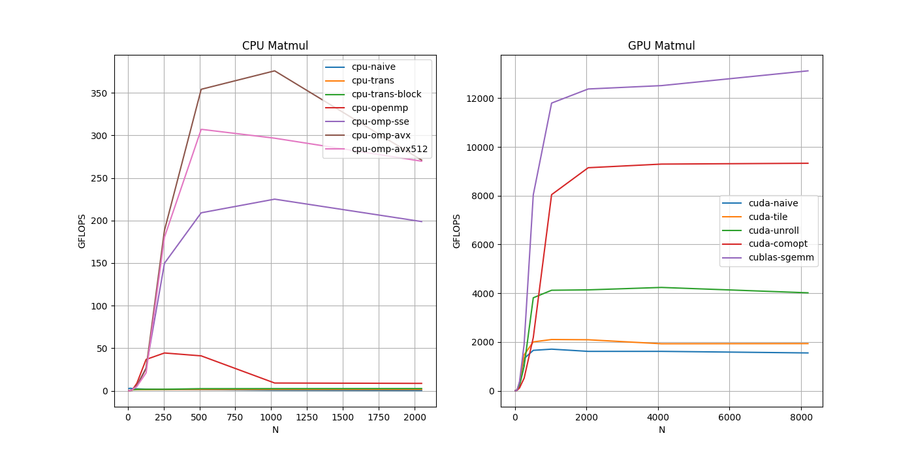

# Matrix Multiplication Optimization Methods

This is a toy benchmark experiment of several matrix multiplication algorithms. 

## Requirements
- googletest
- google/benchmark
- openmp
- CUDA

## Algorithms
- Naive: the pure method for calculating `C = A * B`, the time complexity is `O(N^3)`
```
for(int i = 0; i < A.rows; ++i) {
    for(int j = 0; j < B.cols; ++j) {
        C[i][j] = 0;
        for(int k = 0; k < A.cols; ++k) {
            C[i][j] += A[i][k] * B[k][i];
        }
    }
}
```
- Naive-Trans:
in `Naive`, the access of `B[:][i]` is not cache-friendly, and we can transpose `B` (cost `O(N^2)`) before doing matmul, 
```
// Bt = B.transpose()
for(int i = 0; i < B.rows; ++i) {
    for(int j = 0; j < B.cols; ++j) {
        Bt[j][i] = B[i][j];
    }
}
// C = A * B
for(int i = 0; i < A.rows; ++i) {
    for(int j = 0; j < B.cols; ++j) {
        C[i][j] = 0;
        for(int k = 0; k < A.cols; ++k) {
            C[i][j] += A[i][k] * Bt[i][k]; // cache friendly 
        }
    }
}
```
- Using OpenMP : a simple method via multi-cores

- Using SIMD (CUDA) : naive method, shared memory based method

- Using SIMD (CPU): SSE, AVX, etc.

- Strassen : 


## Benchmark
run the benchmark via the executable `bench`, an example log : 
```
Running ./bench
Run on (48 X 3500 MHz CPU s)
CPU Caches:
  L1 Data 32 KiB (x24)
  L1 Instruction 32 KiB (x24)
  L2 Unified 1024 KiB (x24)
  L3 Unified 16896 KiB (x2)
Load Average: 12.04, 9.15, 5.18
***WARNING*** CPU scaling is enabled, the benchmark real time measurements may be noisy and will incur extra overhead.
--------------------------------------------------------------------------
Benchmark                                Time             CPU   Iterations
--------------------------------------------------------------------------
CPU-Naive/8/manual_time              0.419 us        0.445 us      1668234
CPU-Naive/16/manual_time              2.90 us         2.93 us       241077
CPU-Naive/32/manual_time              24.3 us         24.4 us        28809
CPU-Naive/64/manual_time               212 us          212 us         3303
CPU-Naive/128/manual_time             2101 us         2101 us          333
CPU-Naive/256/manual_time            18550 us        18548 us           38
CPU-Naive/512/manual_time           191031 us       191018 us            4
CPU-Naive/1024/manual_time         3097644 us      3097494 us            1
CPU-Naive/2048/manual_time        40477235 us     40475069 us            1
CPU-Naive/manual_time_BigO      15408849.58 N    15408027.87 N    
CPU-Naive/manual_time_RMS              123 %           123 %    
CPU-NaiveTrans/8/manual_time         0.373 us        0.399 us      1876359
CPU-NaiveTrans/16/manual_time         2.67 us         2.69 us       262164
CPU-NaiveTrans/32/manual_time         23.6 us         23.6 us        29709
CPU-NaiveTrans/64/manual_time          213 us          213 us         3296
CPU-NaiveTrans/128/manual_time        1998 us         1998 us          351
CPU-NaiveTrans/256/manual_time       17639 us        17638 us           39
CPU-NaiveTrans/512/manual_time      147686 us       147679 us            5
CPU-NaiveTrans/1024/manual_time    1209766 us      1209737 us            1
CPU-NaiveTrans/2048/manual_time    9854045 us      9853558 us            1
CPU-NaiveTrans/manual_time_BigO 3844565.23 N    3844380.98 N    
CPU-NaiveTrans/manual_time_RMS         107 %           107 %    
CPU-OpenMP/8/manual_time              11.2 us         11.2 us        53646
CPU-OpenMP/16/manual_time             11.9 us         12.0 us        63845
CPU-OpenMP/32/manual_time             12.1 us         12.3 us        51707
CPU-OpenMP/64/manual_time             24.4 us         24.6 us        30451
CPU-OpenMP/128/manual_time            92.0 us         92.0 us         6971
CPU-OpenMP/256/manual_time             727 us          725 us          855
CPU-OpenMP/512/manual_time            6453 us         6394 us           78
CPU-OpenMP/1024/manual_time         223085 us       214521 us            3
CPU-OpenMP/2048/manual_time        2266949 us      2182273 us            1
CPU-OpenMP/4096/manual_time       49213679 us     42187013 us            1
CPU-OpenMP/manual_time_BigO     9229216.63 N    7934448.74 N    
CPU-OpenMP/manual_time_RMS             140 %           138 %    
GPU-Naive/8/manual_time               6.42 us         6.45 us       108952
GPU-Naive/16/manual_time              6.65 us         6.68 us       104800
GPU-Naive/32/manual_time              7.03 us         7.06 us        94456
GPU-Naive/64/manual_time              7.29 us         7.32 us        88885
GPU-Naive/128/manual_time             9.59 us         9.62 us        72742
GPU-Naive/256/manual_time             33.6 us         33.6 us        20862
GPU-Naive/512/manual_time              221 us          221 us         3170
GPU-Naive/1024/manual_time            1664 us         1664 us          421
GPU-Naive/2048/manual_time           14392 us        14392 us           49
GPU-Naive/4096/manual_time          115268 us       115258 us            6
GPU-Naive/8192/manual_time          965923 us       965859 us            1
GPU-Naive/manual_time_BigO        94059.25 N      94053.02 N    
GPU-Naive/manual_time_RMS              119 %           119 %    
GPU-Shared/8/manual_time              5.76 us         5.79 us       120500
GPU-Shared/16/manual_time             6.18 us         6.21 us       112636
GPU-Shared/32/manual_time             7.20 us         7.23 us        97280
GPU-Shared/64/manual_time             8.95 us         8.97 us        77845
GPU-Shared/128/manual_time            12.4 us         12.4 us        56483
GPU-Shared/256/manual_time            22.1 us         22.1 us        31667
GPU-Shared/512/manual_time             131 us          131 us         5338
GPU-Shared/1024/manual_time            995 us          995 us          703
GPU-Shared/2048/manual_time           8013 us         8012 us           88
GPU-Shared/4096/manual_time          66809 us        66804 us           11
GPU-Shared/8192/manual_time         573891 us       573878 us            1
GPU-Shared/manual_time_BigO       55795.19 N      55793.79 N    
GPU-Shared/manual_time_RMS             120 %           120 %    
```



